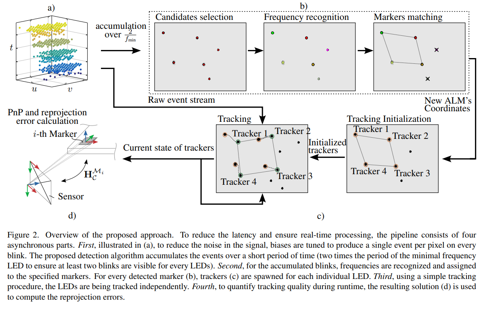

# ALM's Pose Estimator
Official implementation of the Real-time 6-DoF Pose Estimation by Event-based Camera using
Active LED Markers


## Methodology
<p align="center">

</p>

## Installation (without ROS publisher)

Clone GitHub repository
```
cd ALMsPose
```
Requirements:
```
C++ compiler which supports JThread (C++20) - Check compatibility at https://en.cppreference.com/w/cpp/compiler_support
Eigen3 
OpenCV 4
MetavisionSDK or OpenEB
Boost - (For version with ROS publisher required version > 1.78)
```

Clone GitHub repository
```
cd ALMsPose
```

Install [MoodyCamel::ReaderWriterQueue](https://github.com/cameron314/readerwriterqueue)
```
git clone https://github.com/cameron314/readerwriterqueue
cd readerwriterqueue
mkdir build
cd build
cmake ..
make install
```

Clone [MoodyCamel::ConcurentQueue](https://github.com/cameron314/concurrentqueue)
```
git clone https://github.com/cameron314/concurrentqueue
```
Copy concurrentqueue.h to include/external

Build ALMsPose
```
mkdir build
cd build
cmake ..
make -j4
```

## Data
Data available at: [https://drive.google.com/drive/folders/1ZtxlaweJ_zK7Zwi1r4MGsRy8bOFFaNrZ?usp=sharing](https://drive.google.com/drive/folders/1ZtxlaweJ_zK7Zwi1r4MGsRy8bOFFaNrZ?usp=sharing)

Data for figure 4 and 5: Accuracy_recording.raw - raw recording OptiTrack_Accuracy_recording_data.csv - output of the opti track Detection/Iterative*.csv - Output from the algorithm

To align both trajectories, following transformation was used:

Transformation between OptiTrack Camera's marker to Optical center of camera
```
0.0281 0.3011 -0.9532 -0.0173

-0.0202 -0.9532 -0.3017 -0.1612

-0.9994 0.0278 -0.0207 -0.0086

0 0 0 1.0000
```
Transformation between OptiTrack marker for ALM to ALM coordinate space
```
-0.3713 0.9279 -0.0351 -0.0834

-0.0177 -0.0449 -0.9988 0.0080

-0.9284 -0.3702 0.0331 0.3073

0 0 0 1.0000
```
Data for figures 6-7 and Appendix figures 3-4: Ros bags with raw outputs
Figure 8 and Video Supplementary drone start: lift.raw
Viedo Supplementary - High speed flight over marker: t1.raw

## Usage

Files:
- configs/cameras/*.yaml - intrinsic camera matrix
- config/cameras/*.bias - biases
- config/markers/*.yaml - spatial configuration of the marker (x,y,z in meters, freq in Hz)

Example - recording:
```
./active_markers -c ../configs/camera/gen4_camera.yaml -m ../configs/markers/liftoff.yaml -i ../data/liftoff.raw --csv 
```

Example - camera:
```
./active_markers -c ../configs/camera/gen4_camera.yaml -m ../configs/markers/default.yaml -b ../configs/camera/gen4_10kHz.bias --csv 
```

### Important!
In file src/camera.cpp line:
```
        camera_object.get_device().get_facility<Metavision::I_HW_Register>()->write_register(0xB028, 0x100);
```
Sets HW register to reduce MIPI accumulation time - it is valid only for EVK 4.1.
